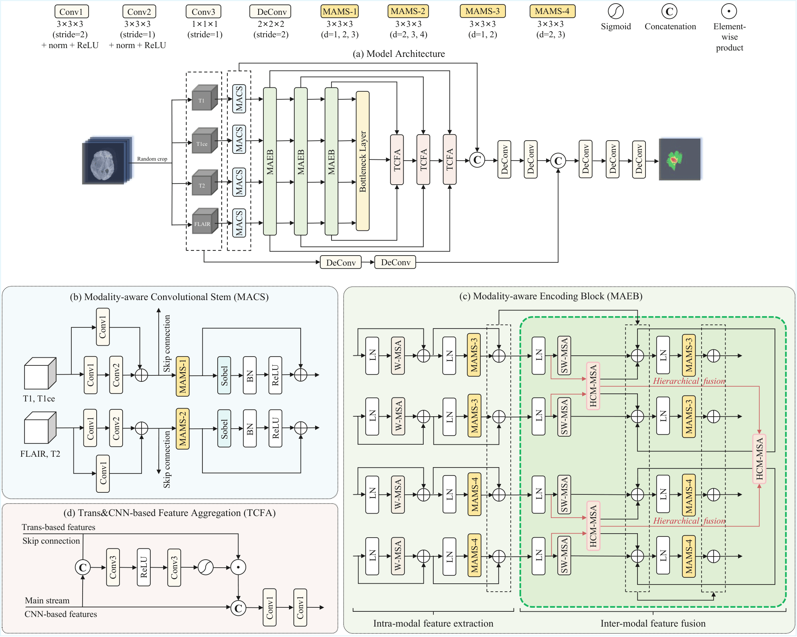

# MA-HybridBTS: Modality-Aware Multi-Scale Hybrid 3D Conv-Transformer for Brain Tumor Segmentation


## Introduction
This is the source code of our paper **[MA-HybridBTS: Modality-Aware Multi-Scale Hybrid 3D Conv-Transformer for Brain Tumor Segmentation](https://ieeexplore.ieee.org/document/11356130)**, which is implemented based on the code of [CKD-TransBTS](https://github.com/Milkomeda98/CKD-TransBTS).



## Abstract
Brain tumor segmentation (BTS) on magnetic resonance imaging (MRI) is essential for diagnosis yet remains challenging due to substantial inter-patient variations and the need to integrate cross-modal interactions. In this work, we propose a modality-aware BTS framework, MA-HybridBTS, to address these challenges through three key components. First, we introduce a modality-aware multi-scale feature extraction (MAMS) strategy that employs 3D dilated convolutions with tailored dilation rates to each sequence, concurrently refining tumor-core details while expanding global context. Second, we present a modality-aware hierarchical fusion (MAHF) module that explicitly leverages clinically established inter-modal dependencies to guide progressive feature fusion. Finally, we propose an adaptive loss function (ALF) that dynamically up-weights sub-regions with larger losses, thereby improving segmentation accuracy for smaller and harder-to-delineate tumor compartments. The proposed methods achieve state-of-the-art performance on the BraTS2021 dataset, delivering an average Dice score of 0.8984 and an average 95% Hausdorff distance (HD95) of 4.14 mm. Ablation studies further validate the effectiveness of each proposed component.


## Requirements
environment.yaml

## Data Preparation

BraTS2021


```
├── dataset/
│   ├── brats2021
│   │   ├── train
│   │   │     ├── BraTS2021_00000
│   │   │	  │		    ├──BraTS2021_00000_t1.nii.gz
│   │   │	  │		    ├──BraTS2021_00000_t1ce.nii.gz
│   │   │	  │		    ├──BraTS2021_00000_t2.nii.gz
│   │   │	  │		    ├──BraTS2021_00000_flair.nii.gz
│   │   │	  │		    └──BraTS2021_00000_seg.nii.gz
│   │   │     ├── BraTS2021_00001   
│   │   │     └── ...
│   │   │        
│   │   ├── val
│   │   |     ├── BraTS2021_00800
│   │   |     ├── BraTS2021_00801
│   │   |     └── ...
│   │   |     
│   │   └── test
│   │         ├── BraTS2021_01000        
│   |         ├── BraTS2021_01001
│   |         └── ...
```

## Getting Started


- Train our method from scratch and test it by:

  - Train

    ```
    python main.py --exp-name "CKD" \
        --device 0 --dataset-folder "dataset/" --batch-size 1 \
        --workers 1 --lr 1e-4 --end-epoch 300 --mode "train"
    ```

  - Inference

    ```
    python main.py --mode test --dataset-folder dataset --exp-name CKD --devices 0
    ```


To test our method directly, you should download the [checkpoint](https://drive.google.com/file/d/1L2o_FxQ-YiH_qVdb-MgxAeOABBD6Fn2_/view?usp=sharing) and place it in the `"CKD_Inference"` folder under the `"best_model"` folder.
  


## Citation
If you find the code useful, please consider citing our paper using the following BibTeX entry.
```
@INPROCEEDINGS{11356130,
  author={Wang, Jiaqi and Miao, Shiqi and Qin, Na and Chen, Xizi and Chen, Xiaolin and Zhu, Lida},
  booktitle={2025 IEEE International Conference on Bioinformatics and Biomedicine (BIBM)}, 
  title={MA-HybridBTS: Modality-Aware Multi-Scale Hybrid 3D Conv-Transformer for Brain Tumor Segmentation}, 
  year={2025},
  volume={},
  number={},
  pages={1-6},
  keywords={Convolutional codes;Training;Three-dimensional displays;Sensitivity;Magnetic resonance imaging;Refining;Brain tumors;Transformers;Lesions;Software development management;Multi-modal fusion;multi-scale convolution;brain tumor segmentation},
  doi={10.1109/BIBM66473.2025.11356130}}

```

